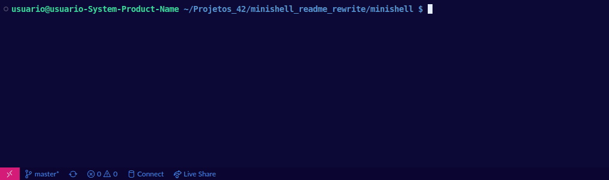
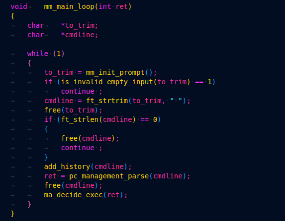
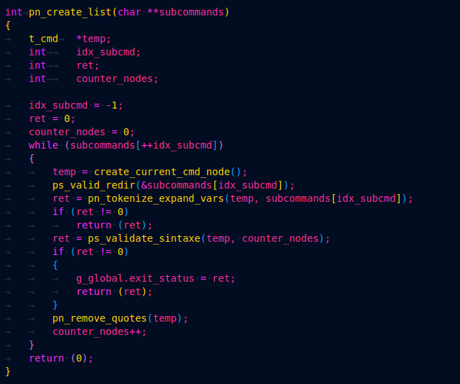
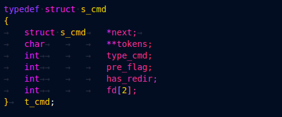
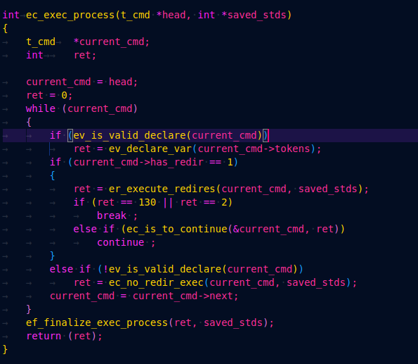

#### Desenvolvido por lfranca- e cleticia

# Minishell

### As beautiful as a shell 
Minishell é um simples interpretador de comandos escrito em C e que usa o bash como modelo.
Ao ser executado, exibe um prompt no terminal e aguarda o usuário entrar uma linha de comando.
Diante de um comando inexistente, emite uma mensagem de erro e exibe novo prompt.  

  

O minishell localiza e executa corretamente builtins e executáveis com base na variável de ambiente `PATH`.
  
 ## Conhecimentos Prévios
[`FD`](https://www.computerhope.com/jargon/f/file-descriptor.htm)  
[`fork`](https://www.section.io/engineering-education/fork-in-c-programming-language/) 
[`token`](https://gcc.gnu.org/onlinedocs/cpp/Tokenization.html) 
[`built-in`](https://www.tutorialspoint.com/ansi_c/c_function_references.htm) 
[`pipe`](https://www.programacaoprogressiva.net/2014/09/Pipes-em-C-Comunicao-entre-Processos-IPC-Interprocess-Communication.html) 
[`exec`](https://www.geeksforgeeks.org/exec-family-of-functions-in-c/) 
[`dup`](https://www.geeksforgeeks.org/dup-dup2-linux-system-call/) 
[`heredoc`](https://linuxize.com/post/bash-heredoc/) 
[`hashtable`](https://www.geeksforgeeks.org/hashing-data-structure/) 
[`environ`](https://opensource.com/article/19/8/what-are-environment-variables) 
  
## Outline <!-- explicar o projeto incluir diagramas -->
Dividimos o minishell em 3 fases:  
  
**Inicialização**  
>> Ao longo do programa, precisaremos acessar algumas variáveis de ambiente para podermos localizar comandos dentro do sistema. Portanto, nessa fase gravamos essas variáveis (envs) na forma de uma lista linkada. Em seguida, iniciamos o loop principal que configura como sinais serão recebidos, inicializa o prompt e serve como eixo para o tratamento e execução da linha de comando, mantendo o minishell aberto.  
  
  Essa fase é definida principalmente pelas funções:  
  
  `mm_list_environ()` - forma a lista linkada de variáveis de ambiente  
  `mm_main_loop()` - loop principal do minishell, serve como eixo para as etapas principais  
  `mm_init_prompt()`- chamada no início do loop principal para configurar sinais e abrir prompt  
  `se_set_main_signals()` - configura sinais  
  
**Parse e lexer**  
>> A linha de comando será dividida em subcomandos (delimitados por pipe '|' ). Por sua vez, esses subcomandos serão divididos em tokens para serem analisados e validados.  
  
  Essa fase é definida principalmente pelas funções:  
  
`pc_management_parse()` - analisa e divide a linha de comando, criando uma lista em que cada nodo equivale a um subcomando.  
`sm_split_3()` - divide a linha de comando numa matriz de subcomandos.  
`pn_create_list()` - recebe a matriz e, a partir dela, cria a lista linkada de subcomandos. Nessa função também já validamos a sintaxe, expandimos variáveis e removemos aspas.  
  
**Execução**  
>> Essa fase entra em um loop que itera pela lista de subcomandos, executando um a um e gerenciando inputs e/ou outputs de um para outro ou redirecionamentos para arquivos.     
  
  Essa fase é definida principalmente pelas funções:  
  
`ec_exec_process()` - loop principal dessa fase. Avalia a existência de redirecionamentos no subcomando e, a partir disso, verifica a existência de pipes e executa de acordo.  
`er_execute_redires()` - chamada caso o subcomando tenha redirecionamento para o próximo subcomando.  
`ec_no_redir_exec()` - chamada caso o subcomando não apresente redirecionamento.  
`ef_finalize_exec_process()` - após executar todos os subcomandos que compõem a linha de comando pedida pelo usuário, essa função libera a lista para que o processo todo se reinicie.  
  
## Fluxo Principal
  
É possível partir dos seguintes três loops como resumo da implementação: 
> main_loop()  
>> create_list()  
>> exec_process()  
  
### Análise
Inicializa o projeto modificando o padrão de interrupção `SIGINT` e `SIGQUIT`, preparando para receber as linhas de comando.  
Então duplicamos a matriz original `environ` vinda de fora do programa.  
Ao mesmo tempo que divide a linha em duas strings por chave e valor.  
Depois a lista de variáveis de ambiente é criada.  
Em seguinda liberamos a matriz criada com o conteúdo separado, para posteriormente refazer esse processo.  
Então o programa acessa a `main_loop()` abrindo o mini interpretador.  
O loop principal é inicializado para que os inputs sejam lidos e enviados para a função de gerenciamento.  

  

  
### Lexer e Parse
Nessa parte a função para gerenciamento e tratamento da linha de comando `management_parse` é inicializada.  
Para fazer o parse  dividimos a linha de comando em subcomandos, criando uma matriz de subcomandos.  
Em seguida na `create_list()` iniciamos o loop para ler a matriz e criar a lista.  
  

  

  

Cada nodo equivalerá a um subcomando, ou seja, cada nodo terá a matriz de tokens de determinado subcomando.

###### Consideramos um subcomando o que está entre pipes e se não houver pipes o comando terá a mesma tratativa que o subcomando.<!-- ###### p.s: O loop lê um item da matriz e cria um nodo e assim sucessivamente.-->
A medida que criamos nodos fazemos a análise e ajustes para receber os tokens.  
Desenvolvemos funções para:  
Validar redirecionamentos  
Verificar aspas  
Verificar a presença de variáveis  
Expandir variáveis (com atenção para aspas).  
Reconstrução de string (para os casos que precisam inserir espaço entre as redireções).  
Ordenação da `comandline` (para os casos em que o comando não encontra-se no início).  
Então dividimos os subcomandos em partículas que fazem sentido para o interpretador.  
E guardamos na matriz de tokens que estará dentro do nodo com demais informações como:  
- Um par de file descriptors (para o caso de pipe)  
- A informação se termina com pipe, para abrir os FD (leitura e escrita - para ser usado no fork).  
Por fim, remover aspas  

### Execução
O programa inicializa `exec_process()`.  
  

  

  
  
Os comandos são executados a medida que a lista_de_comandos é iterada.  
Os FD's de entrada e saída padrão (apontados para o terminal) são "salvos".  
Dessa forma, garantimos no final da execução do comando, a restauração dos FD's no mini interpretador(quando houver pipe ou redirecionamento para/de algum arquivo).  
Uma versão em matriz das variáveis de ambiente é criada no loop de execução (dentro das funcoes de cada caso - se tiver redirecionamento, ou se nao tiver). Assim, podem ser usadas caso o comando seja um executável ou se precisar dessas variáveis posteriormente.  
Ao final de cada repetição, liberaremos a matriz (recriada a cada iteração para não perder a informação).  

#### De forma resumida o loop é constituído de três partes: 

 - `Primeiro if:` Confere se o comando tem declaração de variável. Se não, a declaração é feita;
 - `Segundo if:` Examina se o comando tem redireção, se tiver, a `ec_execute_redires()` é acionada.   
 Essa função diferencia quando são apenas redireções, portanto sem comando. Exemplo: < infile1.txt > outfile1.txt.
 Ou quando for comando, verifica e executa se houver pipe `execute_redirs_piped()` e se não houver pipe `execute_redirs_no_pipe()`. 
 Por sua vez essas duas funções analisam se tem ou não redirecionamento de `heredoc` e executará de acordo.
 - `Terceiro if:` (na verdade, o else): é a condição por não entrar no fluxo do `Segundo if`, ou seja, significa que não há redirecionamentos.
 A `ec_no_redir_exec()` segue o fluxo em condição específica para o caso do comando ser um `builtin` sem pipe (que será executado no próprio
 processo parent).   
 Caso não seja, há um "else" pra isso, onde executará o comando para criar um novo processo fork(), e que atende casos em que pode ser builtin, mas está numa
 sequência de pipe, ou se é um executável (e daí independente de ter pipe ou não, precisa ser executado num processo filho). 
 - Uma vez que o loop de comandos é terminado, chamamos a função de finalização `finalize_exec_process()` que atribuirá o valor correto
 à variável global `exit_status` e fará a liberação da lista de comandos.  

  
## Compilação  
**Clone esse repo**  
> git clone [url do repo] [nome do diretorio]  
  
**Entre no diretorio**  
> cd [nome do diretório]  
  
**Gere o executável**    
> make  
  
## Execução    
> ./minishell  

## Depuração 
[`analysis tool`](https://valgrind.org/docs/manual/manual-core-adv.html)  
**Lista as ocorrências de erros**  
> valgrind --leak-check=full ./minishell  
  
**Lista erros com mais detalhes**
> valgrind --leak-check=full --show-leak-kinds=all ./minishell  

